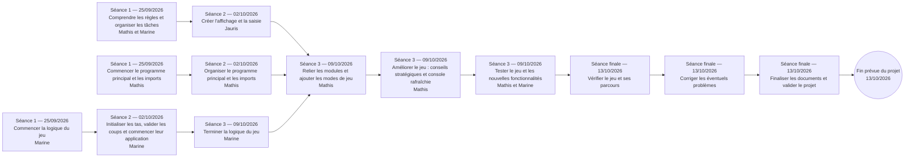

# Carnet de bord

## 25/09/2026 — Séance 1 bis

Présents : Mathis, Marine  
Absents : Jauris Victoir

### Ce qui était prévu
- Finaliser la constitution du groupe.
- Lister l'ensemble des tâches.
- Définir un ordre de réalisation.
- Répartir les premières tâches entre les membres.
- Comprendre la logique du jeu de Nim.

### Ce qui a été fait
- Rechercher et comprendre la logique du jeu.
- Dresser la liste des tâches.
- Marine a créé le fichier `nim_logique.py` et commencé les fonctions `initialiser_tas()` et `coup_valide()`.
- Mathis a commencé le fichier principal `main.py` et importé les deux fonctions de Marine.

## 02/10/2026 — Séance 2

Présents : Mathis, Marine, Jauris

### Ce qui était prévu
- Jauris : commencer les fonctions d'affichage et de saisie des coups.
- Marine : terminer l'initialisation des tas et la validation d'un coup.
- Marine : commencer les fonctions permettant de jouer un coup et de déterminer si la partie est terminée.
- Mathis : organiser le fichier principal et commencer à relier les différents fichiers.
- Tester ensemble l'avancement du jeu et noter ce qu'il reste à faire.

### Ce qui a été fait
- Jauris a créé les fonctions permettant d'afficher les règles et les tas, de demander un coup et d'annoncer le gagnant.
- Marine a écrit les fonctions `initialiser_tas()` et `coup_valide()`.
- Mathis a préparé la fonction principale `jeu_nim()` et commencé les imports des autres fichiers.
- Les prochaines étapes ont été identifiées : terminer les fonctions et tester une partie complète.

## 09/10/2026 — Séance 3

Présents : Mathis, Marine

### Ce qui était prévu
- Terminer les fonctions permettant de jouer un coup et de déterminer si la partie est terminée.
- Relier les différents fichiers au fichier principal.
- Tester une partie complète et noter les éléments restant à terminer.
- Ajouter des fonctionnalités et des améliorations pour rendre le jeu plus agréable à utiliser.

### Ce qui a été fait
- La fonction qui applique un coup valide et la détection de fin de partie ont été ajoutées.
- Une partie complète à deux joueurs avec alternance des tours a été mise en place.
- Un menu permettant de choisir la configuration classique, de créer une configuration personnalisée ou de quitter a été ajouté.
- La possibilité de rejouer après une partie a été ajoutée.
- Une aide stratégique a été ajoutée : le joueur peut saisir `c` au choix du tas pour demander un conseil de coup.
- La console est effacée après chaque coup valide, puis les règles et l'état actualisé des tas sont réaffichés.
- Le parcours personnalisé, la victoire et le refus d'un coup invalide ont été vérifiés.
- La demande d'un conseil et le rafraîchissement de l'affichage au cours d'une partie ont également été testés.

## 13/10/2026 — Séance 4 (séance finale prévue)

### Objectif de la séance
- Effectuer une dernière vérification du jeu complet, y compris les saisies invalides et les deux modes de configuration.
- Corriger les éventuels derniers problèmes.
- Finaliser le carnet de bord et les documents du projet.
- Valider la version finale et clôturer le projet.

La fin du projet est prévue à l'issue de cette séance. Les tâches ci-dessus restent à confirmer après la séance.

## Diagramme PERT du projet

Le diagramme présente l'enchaînement des travaux des quatre séances et indique l'auteur ou les auteurs de chaque tâche. Les tâches de la séance du 02/10 sont représentées en parallèle, car elles ont été réparties entre les membres du groupe. Les auteurs des améliorations ajoutées en séance 3 et les responsables de la séance finale restent à confirmer. Les durées n'étant pas indiquées dans le carnet de bord, le diagramme montre les dépendances sans estimer de durées.

